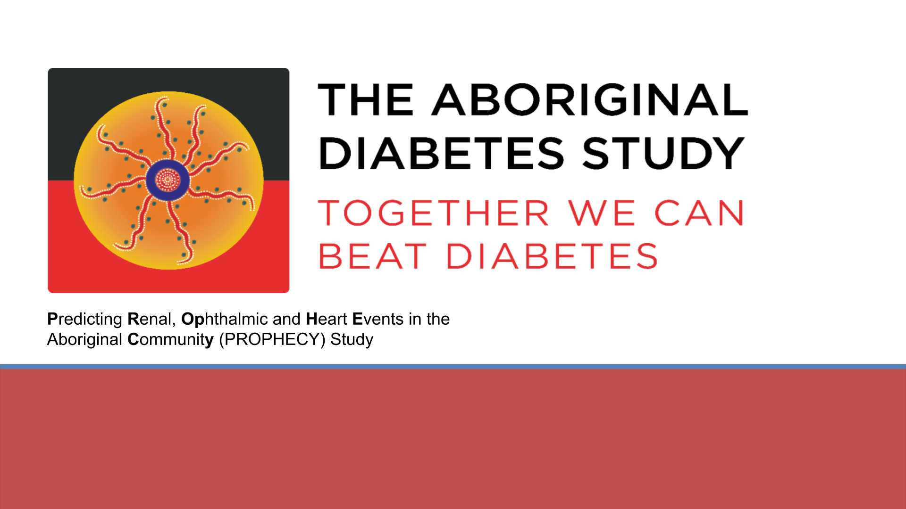

##

::: {.columns}

::: {.column width="35%"}

### Acknowledgement of Country

:::

::: {.column width="65%"}

I would like to acknowledge that many of us are meeting today on Kaurna Country (Karrawirraparri: Redgum Forest River). 

I acknowledge the deep feelings of attachment and relationship of the Kaurna people to their Place.  

I also pay my respects to the cultural authority of Aboriginal and Torres Strait Islander peoples from other areas of Australia online today, and pay my respects to Elders past, present and emerging. 

:::

:::

::: {.notes}
I also wish to express how grateful I am for the opportunity to be involved in this space.
I'm acutely aware of the trust that has been placed in me and am very pleased to be surrounded by so many wise & experienced researchers
:::

## About Me

- Did 1st year science in 1986 $\rightarrow$ completed 2002-2005
    + 1988-1991: Elder Conservatorium
    
::: {.fragment}
- First came across R (1.5.1) analysing two-colour microarrays in Dec 2002

{fig-align="left"}
:::

## About Me

:::: {.columns}

::: {.column width=55%}

- PhD 2008-2018
    + Normal student: 2008-2011
    + Homeless/Couch-surfing: 2012-2013
    + Bioinformatics Hub: 2014-2020
    
::: {.incremental}
- 2020-2022: Dame Roma Mitchell Cancer Research Labs
- 2022-2026: Black Ochre Data Labs
:::
    
::: 

::: {.column width=45%}    
{height=300px}
{height=300px}
:::    

::::    
    
## Bioconductor Enthusiast

{.absolute left=0 top=100 width='150px'}

{.absolute left=200 top=100 width='150px'}

{.absolute left=400 top=100 width='150px'}

{.absolute left=600 top=100 width='150px'}

{.absolute right=100 top=100 width='150px'}
    

- Also developed & maintain `strandcheckR` (Hien To)
    + Helped with `sSNAPPY` (Nora Liu) + `tadar` (Lachlan Baer)
- Currently co-chair of Community Advisory Board 
    + Leading BiocAsia Working Group

{.absolute right=0 bottom=100 width='150px'}
{.absolute right=200 bottom=100 width='150px'}

## The PROPHECY Study

## The PROPHECY Study

## 

## The PROPHECY Study

::: {.fragment .fade-in-then-out data-fragment-index="1"}

::: {.rect_outline .absolute top='220px' left='240px' width='120px' height='80px'}
:::

:::

##

Is large cohort transcriptomics just scRNA without the zero counts?

. . .

{fig-align="left"}

