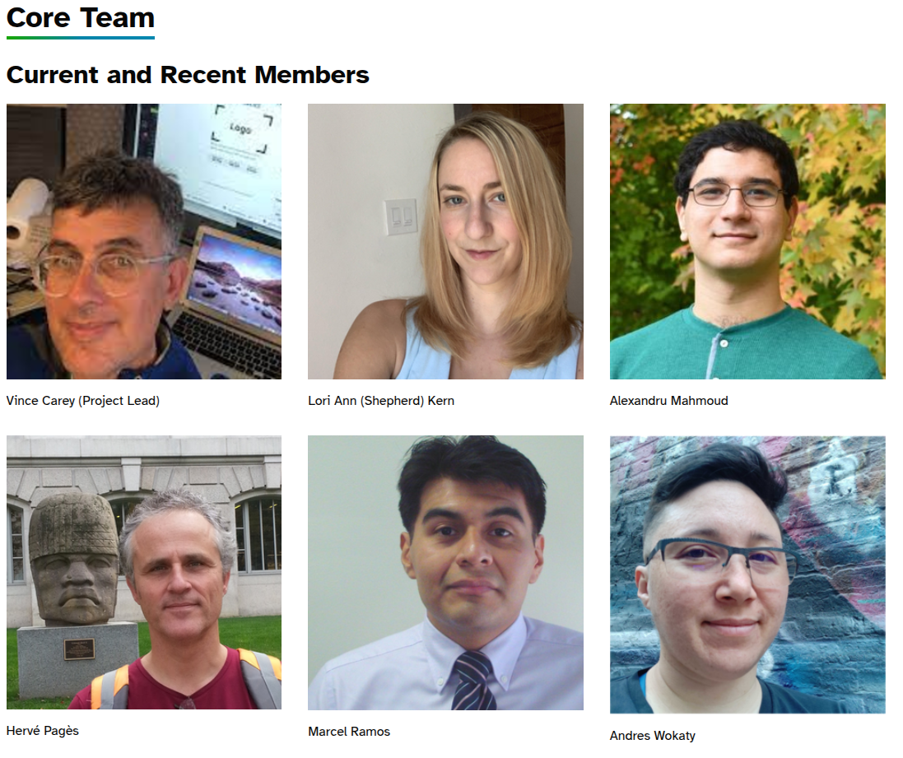
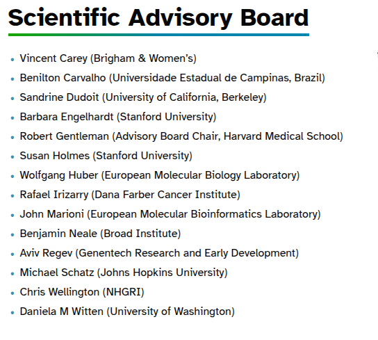
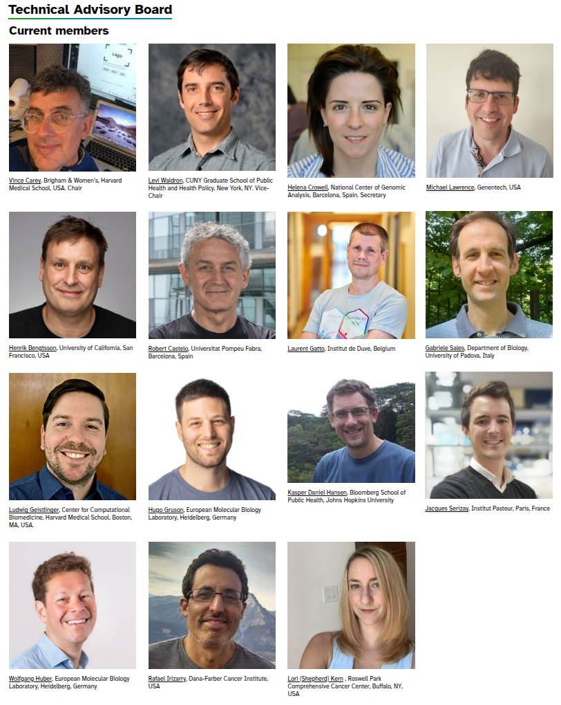
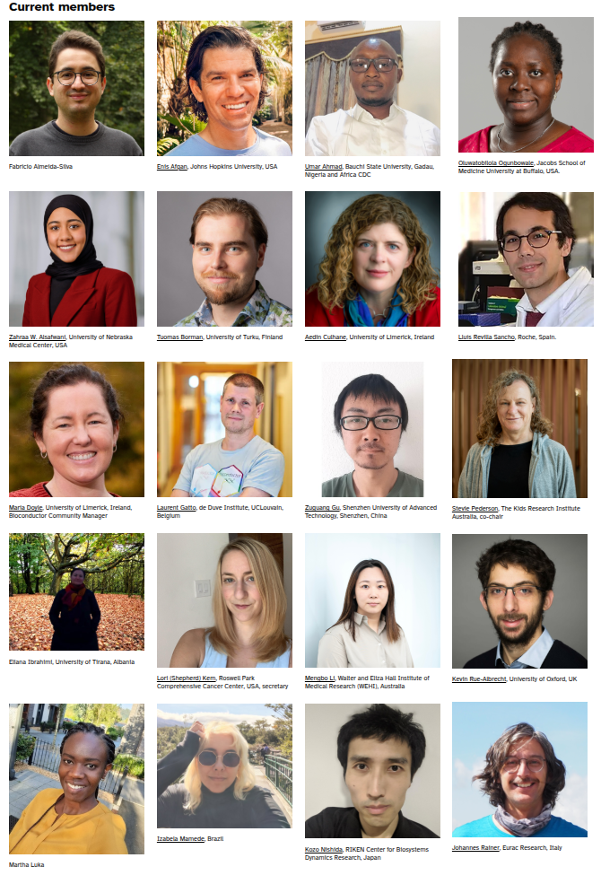
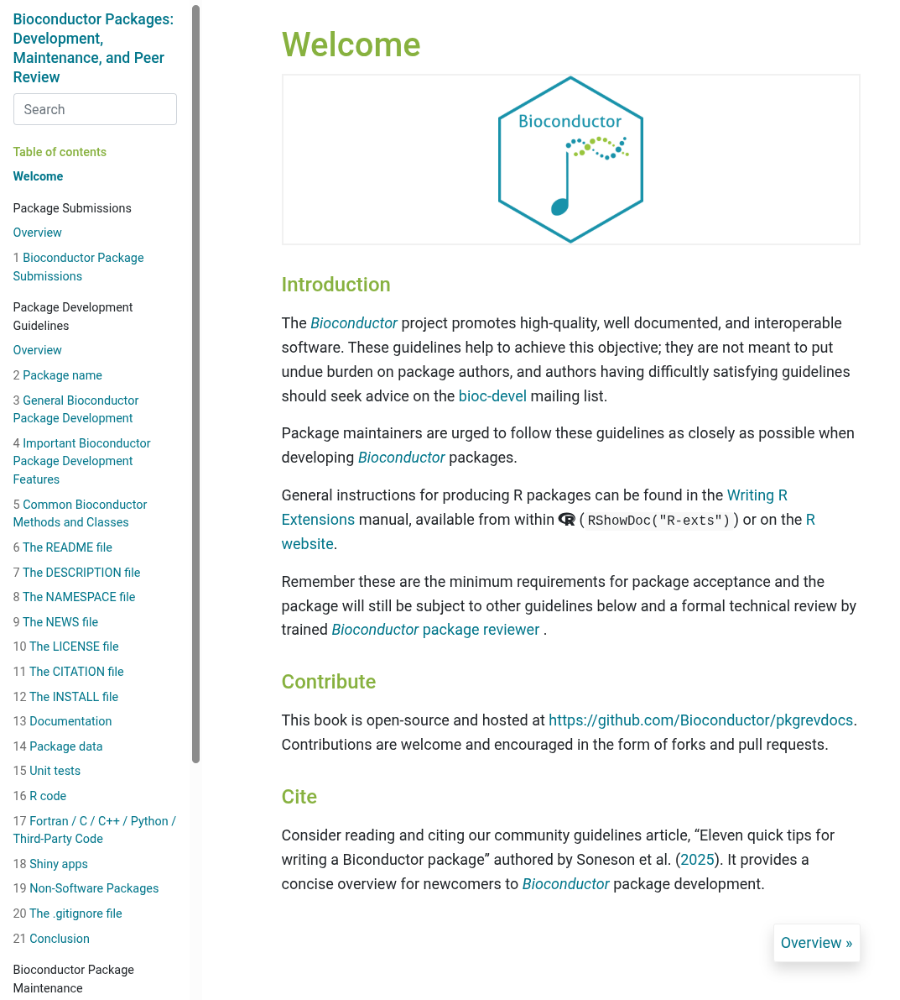

```{r packages, echo = FALSE}
library(tidyverse)
library(bodlR)
library(reactable)
library(htmltools)
theme_set(theme_bodl())
```


## About Me

- Posdoctoral Bioinformatician, The Kids Research Institute Australia (Adelaide)
- Leading transcriptomics analysis of large-cohort, multiomics study (n > 1000)
    + T2D + Complications (CVD, CKD, DR) in the SA Aboriginal Community
- Coordinator, Bioinformatics Hub, University of Adelaide 2014-2020
- PhD, University of Adelaide 2008-2018 (Prof Simon Barry, Prof Gary Glonek)

. . .

- First exposure to R was as an undergraduate student 2002 (v1.5?)
    
## Bioconductor Enthusiast

{.absolute left=0 top=100 width='150px'}

{.absolute left=200 top=100 width='150px'}

{.absolute left=400 top=100 width='150px'}

{.absolute left=600 top=100 width='150px'}

{.absolute right=100 top=100 width='150px'}
<br><br><br><br>

- Also developed & maintain `strandcheckR` (Hien To)
    + Helped with `sSNAPPY` (Nora Liu) + `tadar` (Lachlan Baer)
    
::: {.fragment}
    
- Currently co-chair of Community Advisory Board 
    + Leading BiocAsia Working Group

:::

## What Is Bioconductor?

:::: {.columns}
::: {.column width='48%'}
::: {style="font-size:80%"}

- Started in 2001 by Robert Gentleman, Dana Farber Cancer Research Institute
    + Raphael Irizarry, Sandrine Dudoit, Vince Carey
    + Version 1.0, May 2002 (R v1.5)
- First publication: Genome Biology 2004

::: {.fragment}
Key aims:

- Reproducibility
- Transparency
- Efficiency
    + Computational & Method Development
- Statistical Rigour

:::
    
:::
:::

::: {.column width='52%'}

:::

::::

## What Is Bioconductor?

- Has become a highly connected, ecosystem of packages
    - 2418 Software, 928 Annotation, 436 Data & 25 Workflows
- Computational efficiency paramount for genomic data
    + `S4`-focussed ecosystem (`Vector`, `List`, `DataFrame`, `Rle` etc)
    + "Tidy" approaches gaining popularity and being developed
- Core classes expected to be used across packages
    + e.g. `GenomicRanges`, `SummarizedExperiment`
    + Clearly defined structures for *sample metadata* and *genomic metadata*
- Classes can be extended across contexts <br>$\implies$ DNA methylation, single-cell RNA-Seq etc

## Governance

- Core Team
- Scientific Advisory Board (~2012)
- Technical Advisory Board (~2013)
- Community Advisory Board (~2020)

::: {.fragment .fade-out fragment-index=1}

{.absolute right=0 top=100 width='600'}
:::

::: {.fragment .fade-in-then-out fragment-index=1}

{.absolute right=0 top=100 width='650'}
:::

::: {.fragment .fade-in-then-out fragment-index=2}

{.absolute right=0 top=0 width='600'}
:::

::: {.fragment .fade-in-then-out fragment-index=3}

{.absolute right=0 top=0 width='600'}
:::

## Packages

- Twice annual release $\implies$ shortly after R releases
    + Release has minimum R version requirements
    + Keep package interdependencies stable & reproducible within release
    + Bugfixes within release but **not** major UI updates
    + Release 3.23 April 2029
- Docker Containers also released with each cycle
- Twice weekly build testing (release) + nightly (devel)
    + Formerly the Bioconductor Build System (BBS) <br>$\implies$ Windows, OSX, Linux, Arch
    + Migrating to R-Universe for testing (& distribution)
    
## Installation

- Recommended method `BiocManager::install()`
    + Accepts a version argument and auto-detects
- Can also check version `BiocManager::version()`
- Also installs from `CRAN`
- Compatible with `remotes` syntax: `BiocManager::install("user/repo")`
    + Can't enforce version compatability using `remotes`

## Package Submission

:::: {.columns}
::: {style="font-size:80%"}
::: {.column width='45%'}
- Packages submitted by opening a github issue: `Bioconductor/Contributions`

::: {.fragment fragment-index=1}
- Submission process documented in a Bioconductor book
    <!-- + https://contributions.bioconductor.org/index.html -->

:::

::: {.fragment}
- Submitted to `devel` for inclusion in next `release`
- Reviewed by community volunteer
- Must include a vignette
- Standard `S4` object classes **strongly** recommended
    + Results as `tibble`s etc are also fine
- Can only depend on Bioc/CRAN packages    
    
:::

:::

::: {.column width='55%'}
:::
:::
::::

::: {.fragment .fade-in fragment-index=1}

{.absolute right=0 top=0 width='650'}
:::

## Key Additional Questions For Panel:


- Submit to Bioconductor if depending on Bioc infrastructure/classes
    + CRAN can be tetchy with overly large vignettes
    + Package size requirements also strictly enforced
    
::: {.fragment}

- Packages must pass `R CMD check` **and** `BiocCheck::check()`

:::    

::: {.fragment}

- Aarnet have recently re-established local mirror
    + I have not tested installation

:::
