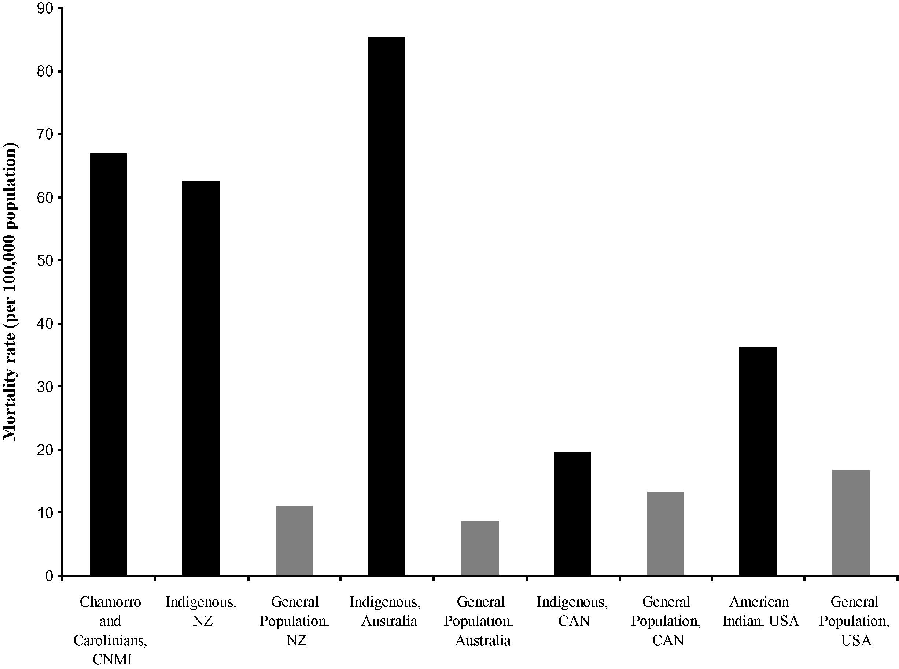
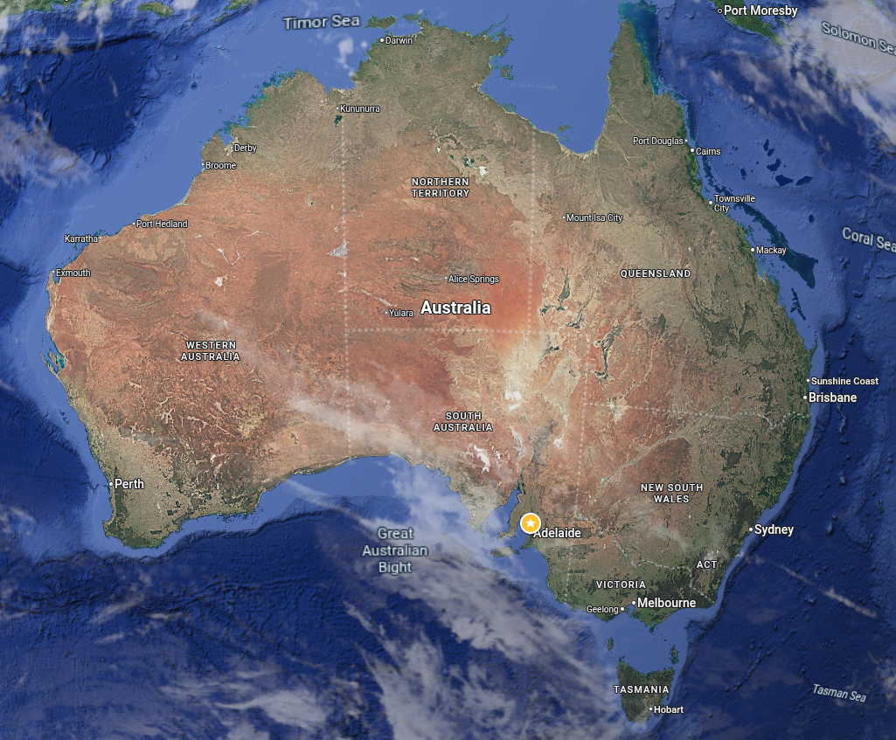
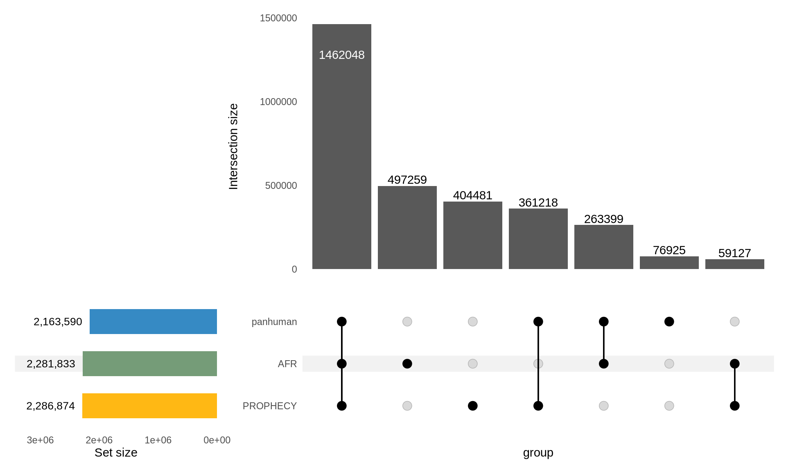
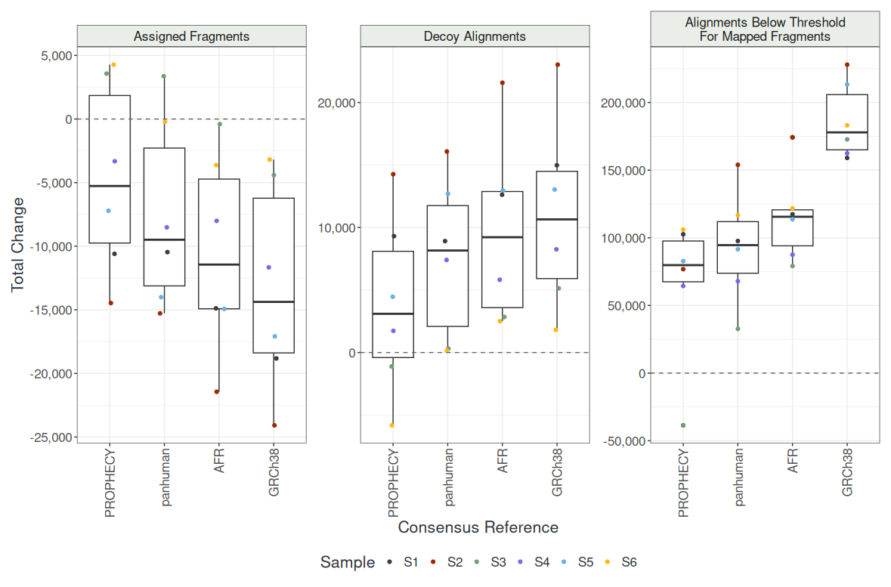
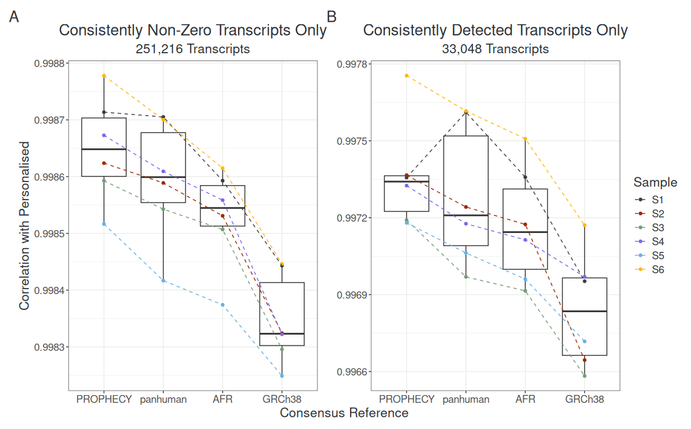
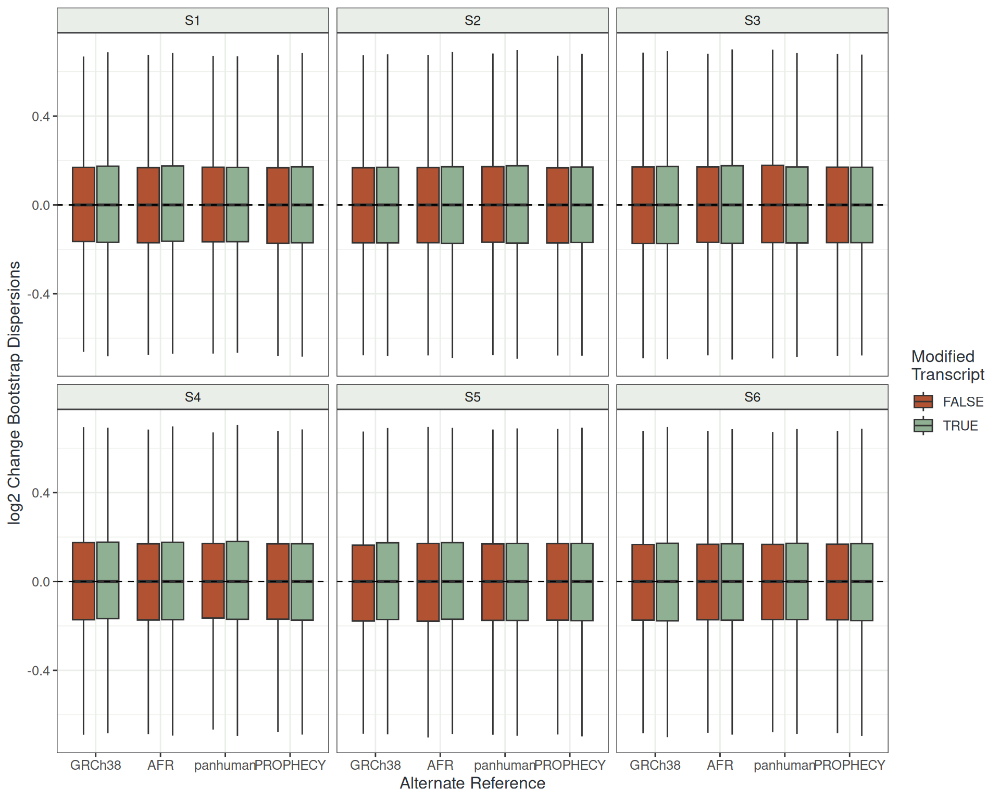
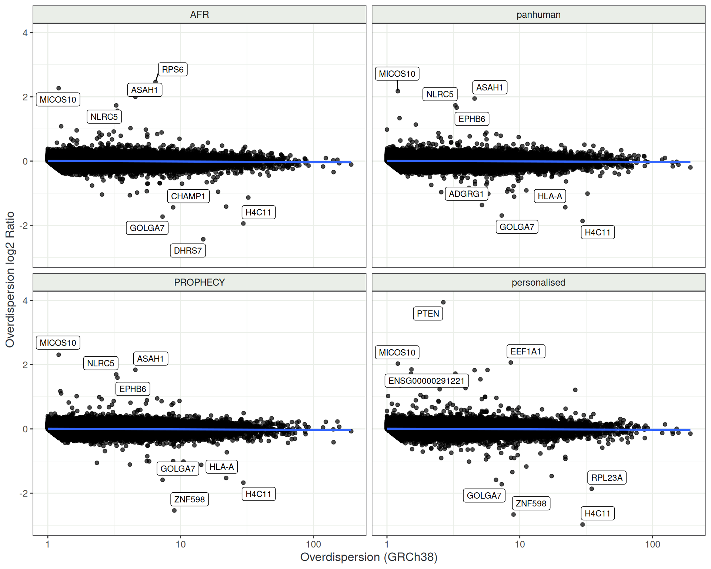
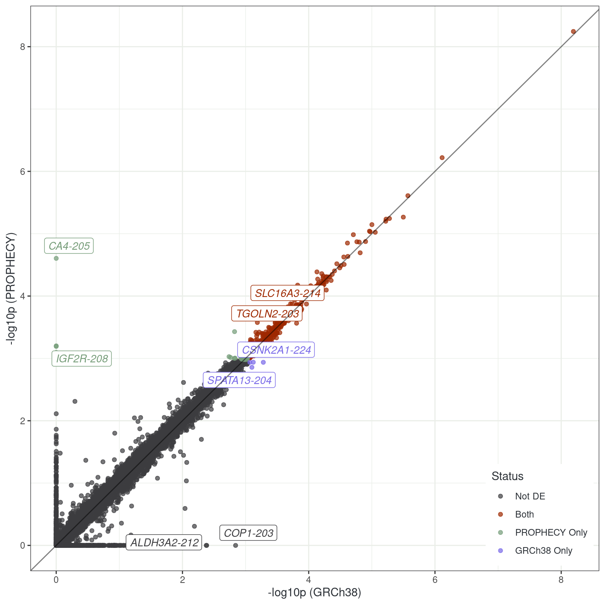
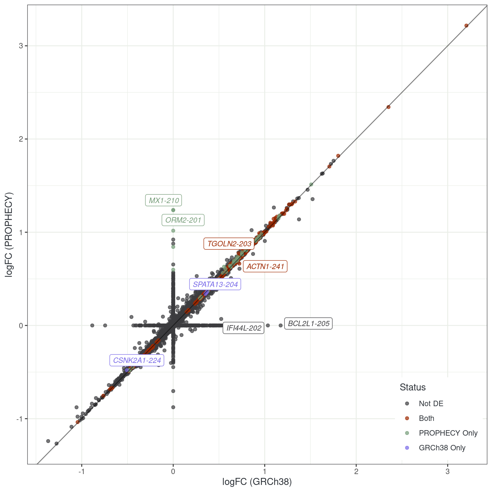

## The PROPHECY Motivation

:::: {.columns}
::: {.column width='60%'}

:::

::: {.column width='40%'}
::: {style="font-size:85%"}

- Type 2 Diabetes in Indigenous Australians
    + Mortality rate is ~10x higher 
    - Age of onset is much earlier
- Complication rates $\uparrow\uparrow\uparrow$
    + Cardiovascular Disease
    + Chronic Kidney Disease
    + Diabetic Retinopathy
    

:::
:::
::::

::: {.rect_outline .absolute bottom='80px' left='290px' width='145px' height='550px'}
:::

## The PROPHECY Multiomics Project

:::: {.columns}
::: {.column width='60%'}

:::

::: {.column width='40%'}
::: {style="font-size:85%"}

- Indigenous led project
    - Run from Adelaide (+ Perth)
    + Historical lands of Kaurna people
- 1391 participants from SA Aboriginal communities

::: {.fragment}

- DNA, DNAme, **RNA**, Proteomics, Lipidomics, Metabolomics, Inflammatory Panel, ECG, Retinal scans, clinical & psychosocial measures etc

:::
:::
:::
::::

## Variation Within The Indigenous Australian Population

- 25% of genomic variation unique to Australian Aboriginal population [@Easteal2020-fo]
- If variants are driving progression $\implies$ will we see it in the RNA-seq?
- `STARconsensus` has shown improved mapping and quantification [@Kaminow2022-dz]
    
::: {.fragment}
- Can we bring the reference *transcriptome* closer to our participants?
- What impact will this have at both the gene-level and the transcript-level?
:::

## The Package `transmogR`

- Can take a set of variants (SNP + INDEL)
    + Also checks for overlapping variants
- Modify genome sequence [$\implies$ co-ordinates change]{.fragment}

::: {.incremental}

- Track coordinate shifts after modification
- Optional tags added to sequence IDs
- Modify transcriptome sequences
- `digestSalmon()`: parse counts, TPM, effLen & overdispersions
    + Can handle divergent references: Complete vs chrY-excluded
    + Personalised transcriptomes 

:::

{.absolute top=0 right=20 width=200}

## Benchmarking

::: {.notes}
- Very similar strategy to STARconsensus
- Different assessment criteria (i.e. not unique-alignments)
:::

::: {style="font-size:90%"}

- Assuming personalised references $\implies$ *optimal* quantification
    + n = 6 (Pilot Study)
- "Ground truth" for comparison to *consensus references*
- Chose all homogeneous sites + 50% of heterogeneous sites
- Considered the "best-case" set of pseudo-alignments (and counts)
- Still only a haploid reference

::: {.fragment}

- Compared to 1) GRCh38, 2) AFR, 3) 'panhuman' and 4) PROPHECY-consensus transcriptome
    + panhuman derived from all 1000GP sub-populations
    + AFR most divergent from panhuman

:::
:::

## PROPHECY Consensus Variants

:::: {.columns}
::: {.column width='65%'}

:::

::: {.column width='35%'}
::: {style="font-size:85%"}

- Consensus variants:  AF > 0.5 in 'unrelated'
    + PROPHECY participants
    + AFR & Panhuman variant sets from 1000GP
- Tested using `salmon` [@Srivastava2020-tm]

:::
:::
::::

::: {.rect_outline .absolute bottom='160px' left='440px' width='50px' height='350px'}
:::

## Changing `salmon` Metrics

::: {.notes}
- Small decreases in aligned fragment
- Small increase in decoy-preferred alignments
- Increase in alignments below thresholod of mapping
:::

:::: {.columns}
::: {.column width='60%'}

:::

::: {.column width='40%'}
::: {style="font-size:90%"}

- Library sizes: ~50m (2x150)
- Showing changes from personalised references
- PROPHECY consensus consistently closer to personalised
- GRCh38 consistently furthest
- Very similar to `STARconsensus` paper

:::
:::
::::

## Similarity of Transcript Counts

:::: {.columns}
::: {.column width='60%'}

:::

::: {.column width='40%'}
::: {style="font-size:90%"}

- All highly correlated (>99.6%)
- Counts from PROPHECY-consensus reference closest to personalised
- GRCh38 least correlated

:::
:::
::::

## Change In Bootstrap Overdispersions

:::: {.columns}
::: {.column width='60%'}

:::

::: {.column width='40%'}
::: {style="font-size:90%"}

- Taking individual-level boostraps (n = 100)
- Change in alternate refs against personalised
- **No global shift!!!**

:::
:::
::::

## Dispersions Relative To GRCh38

:::: {.columns}
::: {.column width='60%'}

:::

::: {.column width='40%'}
::: {style="font-size:90%"}

- Dataset level dispersions
- Compared to GRCh38
    + Worst but most standard
- What impact would a consensus-variant-based reference have?
- Most are relatively consistent
- Small number strongly changed

:::
:::
::::

## Differential Expression Analysis

- Performed DGE analysis
    + T2D vs No T2D (n = 93, Sam El Osta group)
    + Standard `edgeR::glmQLFit()` methods
- Performed DTE analysis
    + Scaled counts by overdispersions [@Baldoni2024-zf]

. . .

*Do cohort-level results change with the PROPHECY consensus-modified reference trancriptome*?

. . . 

(Not at the gene level. No.)

## Differential Transcript Analysis

:::: {.columns}
::: {.column}

:::
::: {.column}

:::
::::

## Future Directions

- Repeat benchmarking using public data
- Repeat using methods of @Singh2025-fk
- Can `salmon` be extended to a diploid reference?
    + Personalised reference transcriptomes?
    + Cell-line specific reference transcriptomes?
    + Will require rethink of statistical assumptions for DTE/DGE

## Acknowledgements

::: {style="font-size:75%"}

:::: {.columns}

::: {.column width='28%'}
[**Black Ochre Data Labs**]{.underline}

*Alex Brown*

*Jimmy Breen*

Alastair Ludington

Sam Buckberry

Liza Kretzschmar

*Yassine Souilmi*

Katharine Brown

Rose Senesi

Sam Godwin

Rebecca Simpson

:::

::: {.column width='28%'}
 
Natasha Howard

Adam Heterick

Kaashifah Bruce

Bastien Llamas

Amanda Richards-Satour

Justine Clark

Holly Massacci

Sarah Munns

Alli Foster

Sehaj Dhariwal

:::

::: {.column width='35%'}

[**Baker Heart & Diabetes Institute**]{.underline}

Sam El Osta

*Ishant Kurma*

Moshe Olshansky

Scott Maxwell

[**Centre For Population Genomics**]{.underline}

*Dan MacArthur*

[**University of Sydney**]{.underline}

Jean Yang

:::
::::

:::

{.absolute bottom=-50 right=70 width=250}

{.absolute left=650 bottom=0 width=280}

# References

##
